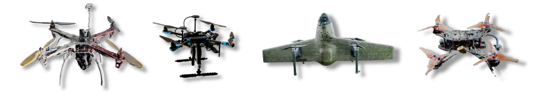

### VISER DroneDiversity Dataset

Below we list the different datasets generated within the VISER Drone Surveillance project.
More info on the VISER project can be found [here](https://www.ri.se/en/what-we-do/projects/visual-inspection-of-airspace-for-air-traffic-safety-and-security).
Essentially it is a system for detecting UAVs in a delimited airspace using several visual sensors. The system is using these synthetic datasets to classify airborne objects detected in the vicinity of critical infrastructure objects.

All datasets described below can be accessed at the following cloud storage link.
[VISER DroneDiversity Dataset](https://mdu.drive.sunet.se/index.php/s/fBFi8n434fToGyX)

## Synth Base
(seg_small_batches previously)

This synthset is generated with 4 categories of objects of interest:  
Commercial multirotor drones (6 different synthetic models), Fixed wing drones  
(2 larger military synthetic drone models), Commercial aeroplanes (1 synthetic  
model) and birds (7 synthetic models), see Figure 6. This is considered our  
baseline synthset. Each recorded snapshot in this dataset is rendered with a  
freshly generated scene, i.e. the scene is considered exploited after one generated  
snapshot and the object perturbation is not applied here.  
This maximizes the scene diversity in the set, at the cost of generation time. The assets are shown below.

## NeRF Diverse

This synthset is generated with the same four categories of objects of interest, however the multirotor category objects are replaced with a total of four different NeRF-based models, see below, which carry a higher degree of photo realism compared to the synthetic multirotor models. Similarly to the Synth Base set, each recorded snapshot in this dataset is rendered with a freshly generated scene, see example below.

## NeRF Perturb

This synthset is generated with the same 4 categories of objects of interest with the same NeRF-based multirotor models. In this dataset, each scene is exploited 10 times (see Figure 3) before a new scene generation step is executed. The objects of interest are randomly moved around the scene, including object pose alteration. This yields a greatly reduced generation time. Because of the quicker generation time, we generated twice the amount of images in this set (i.e. 1000 images per town).

## Swan Perturb

This synthset is generated with the same 4 categories of objects of interest (multirotors, birds, airliners and fixed wings), however in this set we target a specific multirotor model (the Swan), so only this NeRF-based model is in the multirotor object category. Similarly to NeRF Perturb,  
in this dataset each scene is exploited 10 times before a new scene generation step is executed. This dataset is a more targeted set to the detection of this specific multirotor model. Because of the quicker generation time, we generated twice the amount of images in this set (i.e. 1000 images per town).

